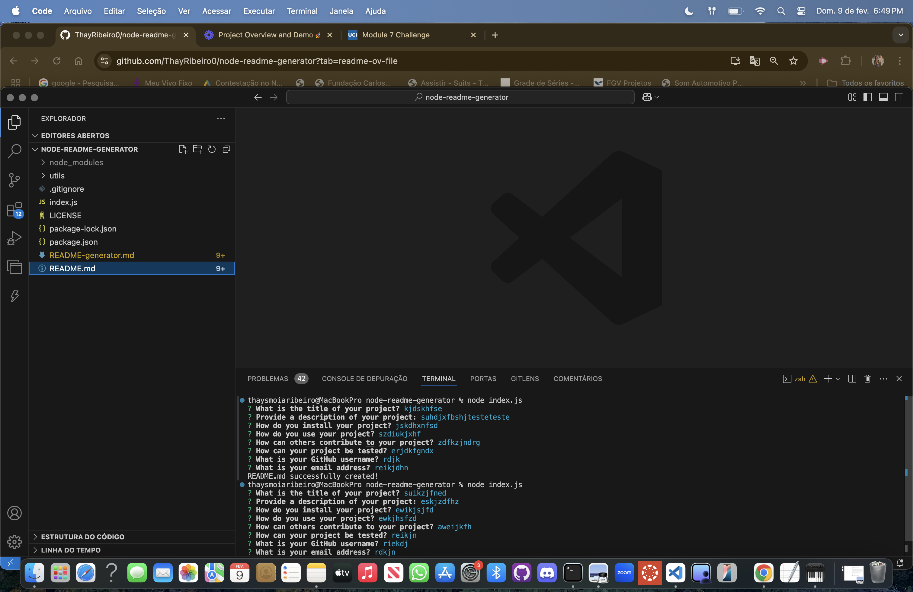

# 🚀 README Generator

## 📖 Description
This project helps you quickly create a README file for your project by answering a few questions in the terminal.

## 🛠️Installation
1. Clone the repository:
    ```
    git clone https://github.com/YourGitHubUsername/node-readme-generator.git
    ```
2. Navigate to the project directory:
    ```
    cd node-readme-generator
    ```
3. Install the required dependencies:
    ```
    npm install
    ```

## 🚀Usage
1. After installation, run the project with:
    ```
    node index.js
    ```
2. Answer the questions about your project.
3. A `README.md` file will be created for you!

### 🎥 Video Tutorial
<a href="https://www.loom.com/share/dc5c5fd971c84740b7eea59d98151ac3?sid=49943ffa-b5bd-4d88-b3bb-1fb059577c1a">
    
</a>

## 🤝 Contributing
To help improve this project, you can:
1. Fork this repo.
2. Create a new branch (`git checkout -b feature-name`).
3. Make your changes and commit them (`git commit -am 'Add new feature'`).
4. Push to the branch (`git push origin feature-name`).
5. Create a Pull Request.

## ✅ Tests
To test, just run `node index.js` and check if the `README.md` file was created.

## ⁉️ Questions
If you need help:
  - GitHub: [ThayRibeiro0](https://github.com/ThayRibeiro0)
  - Email: thaysmoiaribeiro@gmail.com

## 📜 License
This project is licensed under the MIT License - see the [LICENSE](LICENSE) file for details.